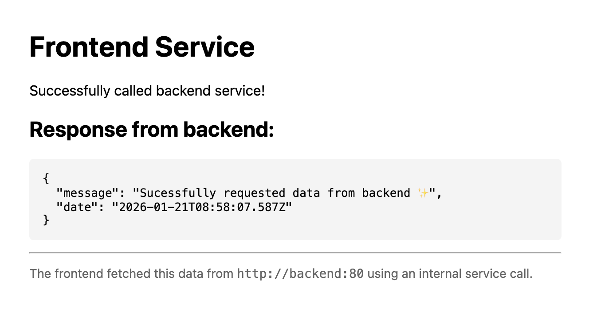

# Service-to-service example
1. Run the **backend** service:  
`cd ./backend && npx @uncloud/run -c uncloud.json`
2. Run the **frontend** service:  
`cd ./frontend && npx @uncloud/run -c uncloud.json`
3. Open up the **frontend** URL (press `o` -or- Hold `shift` while you select the URL to copy it)

→ The frontend calls the backend internally through `http://backend:80`  
→ The `backend` is set to `internal: true` (see `backend/uncloud.json`) - so it's only accessible through the internal service call

**Any container launched with `--name <container-name> -p <port - defaults to 80>`** can be called internally through `[protocol]://<name>:<port>`:  

```bash
npx @uncloud/run -n backend
# Can be reached internaly through http://backend:80

npx @uncloud/run -n db -p 5432
# Can be reached internally through postgres://db:5432
```


  

*Screenshot of the successfully deployed frontend*